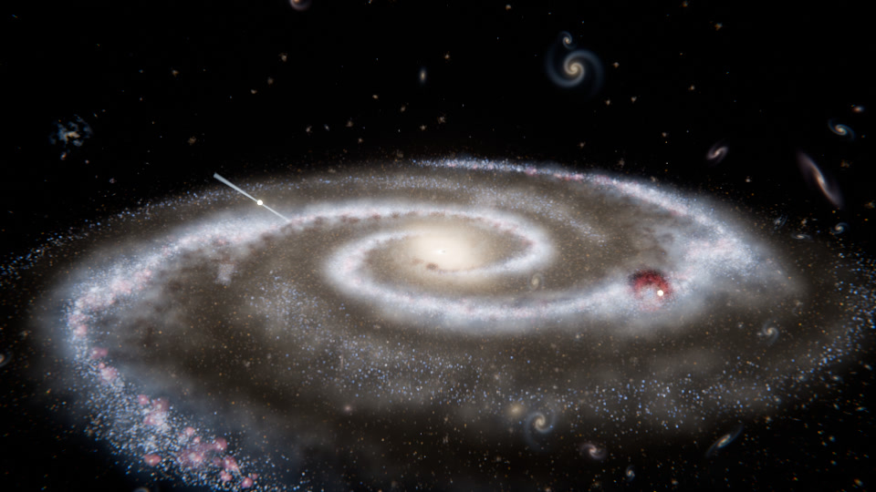

# Endless Destiny

A galaxy music video built entirely by one Blender script, structured around the song
*Endless Destiny*. An **Echoes in the Dark** production.



Run `endless_destiny.py` in Blender and it builds everything:

- **A barred spiral galaxy made of real points of light.** 1.2 million stars on HIGH
  (3 million on ULTRA). Every star gets its colour from its blackbody temperature: hot
  blue O/B stars and open clusters trace the arms, gold giants fill the bulge and bar,
  faint red stars make up the halo. It also has 130 globular clusters and two satellite
  dwarf galaxies.
- **Gas and dust.** Glowing spiral arms, pink H-II star-forming knots, dark dust lanes on
  the inner edge of each arm, and a bright bar and bulge.
- **Set pieces.** The Destiny Nebula (Hubble-palette gas blown into a bubble by a newborn
  cluster), the Destiny Star with echo rings, a pulsar that spins on the beat, a black
  hole with an accretion disk and photon ring, relativistic jets, a galactic shockwave,
  a constellation that only lines up from one spot in the galaxy, meteors, warp streaks,
  and 3,000 background galaxies laid out along a cosmic web.
- **A camera flight in 10 acts that follows the song.** The script reads the audio,
  finds the tempo, the beats, the kicks and the sections, and moves each act onto the
  song's real drops and breakdowns.

Works in **Blender 4.2 LTS, 4.5 LTS and 5.0**, with **Cycles** or **EEVEE**. The same
script was built, saved and re-opened on all three versions.

---

## Quick start

1. Install Blender 4.2 or newer from [blender.org](https://www.blender.org/download/).
2. Put your *Endless Destiny* audio file (mp3, wav, ogg, flac or m4a) **in the same folder
   as `endless_destiny.py`**. Any file name with "endless" or "destiny" in it is found
   automatically. You can also paste the full path into `AUDIO_PATH` at the top of the
   script.
3. Open Blender, click the **Scripting** tab, click **Open**, pick `endless_destiny.py`,
   and press the **Run Script** button (the play icon).
4. Wait about a minute. The Blender console prints the tempo and where each act starts.
5. Go back to the **Layout** tab, move the mouse over the 3D view and press **Numpad 0** for
   the camera view. Press **Space** to play. The timeline markers show where each act
   starts.
6. Press **F12** to render the current frame. Use **Render > Render Animation** for the
   whole video.

No audio file? It still works, using a stand-in 3:20 song at 120 BPM. Add the song later
and run the script again. Each run replaces the previous build.

### From the command line

```bash
blender -b -P endless_destiny.py -- --audio "Endless Destiny.mp3" --render
```

| Option | What it does |
|---|---|
| `--audio PATH` | the song |
| `--engine CYCLES` or `--engine EEVEE` | render engine |
| `--quality PREVIEW`, `HIGH` or `ULTRA` | star count, samples, resolution scale |
| `--fps N` | frames per second (default 30) |
| `--res WxH` | resolution, for example `3840x2160` |
| `--bpm N` | force the tempo instead of detecting it |
| `--acts a,b,c,...` | the 10 act start times in seconds, which skips auto-detection |
| `--seed N` | a different galaxy |
| `--output DIR` | where frames and videos go |
| `--mp4` | render straight to one .mp4 instead of PNG frames |
| `--render` | render the animation after building |
| `--frames A-B` | render only these frames |
| `--still SECONDS` | render one still at that moment in the song (repeatable) |
| `--save FILE.blend` | save the built scene |
| `--video` | join the rendered PNG frames and the song into `ENDLESS_DESTINY.mp4` |

---

## The 10 acts

Default lengths are shown for a 3:20 song. With a real audio file each boundary moves to
the nearest real section change (a jump in bass and loudness for the choruses, a drop in
loudness for the bridge and outro) and then onto the nearest bar line.

| # | Act | What you see | What the music drives |
|---|---|---|---|
| 1 | **Echo in the Dark** | One star in total darkness. Stars light up around it, and "ECHOES IN THE DARK presents" fades in. | An echo ring goes out on every downbeat. The stars light up in bursts on the kicks. |
| 2 | **Nursery of Stars** | A slow drift through the Destiny Nebula, past a newborn star cluster. | The gas glows with the bass, and the hi-hats make the stars twinkle. |
| 3 | **The Pull** | The camera rockets up out of the spiral arm while warp streaks build. | Warp speed rises through the build. |
| 4 | **Destiny Revealed** | The drop. The whole galaxy appears, "ENDLESS DESTINY" flashes up, and the camera circles while the galaxy spins faster. | A flash on the drop, the camera shakes on the kicks, meteors on the strongest hits. |
| 5 | **Riding the Arms** | A low flight along a spiral arm with the core on the horizon, past pink star-forming regions and a pulsar. | The pulsar makes one full turn every two beats, so a beam sweeps past on every beat. |
| 6 | **Alignment** | The camera climbs to the one spot where 14 scattered stars line up. | The constellation fades in as the stars line up. |
| 7 | **Written in the Stars** | The stars join into an infinity sign, one line per beat. | Each line draws on a beat, and the finished sign pulses with the kicks. |
| 8 | **Heart of the Galaxy** | A slow fall into the core: black hole, accretion disk, photon ring. | The disk glow breathes with the bass. |
| 9 | **The Heart Ignites** | The final drop. Jets fire from the black hole, a shockwave rolls through the disk, and the camera blasts back past satellite galaxies into the cosmic web. | A big flash, warp streaks, meteors. |
| 10 | **Endless** | The camera drifts out until the whole universe fades and the galaxy is a single point of light. | Echo rings return on the last downbeats. |

The last frame matches the first: one point of light in the dark. The video loops.

---

## How the music is read

The script decodes the song with Blender's own audio library (with Python's `wave`
module and an `ffmpeg` on the PATH as fallbacks) and works out, for every video frame:

- **Tempo and beat grid.** An onset-strength autocorrelation, refined by a comb search
  over the whole song. Downbeats come from where the bass hits hardest.
- **Kicks.** Peaks in the low-frequency onset strength.
- **Bass, mids, sparkle (hi-hats) and loudness.** Band energies with fast-attack,
  slow-release envelopes.
- **Section changes.** Timbre novelty plus jumps in bass and loudness over 4 seconds.

On a synthetic 128 BPM test song with known sections, it detected **128.0 BPM**, put the
beat grid within 20 ms, and placed **all 10 acts within 0.05 s** of the true section
changes. Real songs are messier. The console prints where each act landed and why
(`music`, `+bar`, or `default`). If an act lands in the wrong place, fix it with
`ACT_STARTS` or `--acts`.

Everything the music drives is baked into keyframes on an empty called `ED_Director`
(custom properties `bass`, `kick`, `beat`, `sparkle`, `energy`, and the story channels).
Materials read them through simple drivers, which work even with Blender's automatic
Python scripts switched off.

---

## Rendering

| Preset | Stars | Cycles samples | EEVEE samples | Resolution |
|---|---|---|---|---|
| `PREVIEW` | 250,000 | 24 | 16 | 50 % |
| `HIGH` | 1.2 million | 64 | 64 | 100 % |
| `ULTRA` | 3 million | 160 | 128 | 100 % |

**Plan for the render time.** A 3:20 song at 30 fps is 6,000 frames. The test frames in
`previews/` were rendered on a 4-core CPU with no GPU, at 480×270 and 8 samples. They took
13 to 95 seconds each, with the flight through the nebula the slowest. A 1080p frame has
16 times the pixels and HIGH uses 8 times the samples, so rendering on a CPU is not
practical. Use a GPU. The script switches Cycles to the first GPU it finds (OptiX, CUDA,
HIP, Metal or oneAPI).

- Render a few `--still` frames at `HIGH` first to time your own machine, then multiply
  by the frame count.
- **EEVEE** is much faster and renders the same scene. Cycles gives cleaner gas and dust.
- 24 fps instead of 30 cuts the frame count by 20 %.
- The default output is numbered PNG frames in `render/frames/`. If a render stops, start
  it again and it carries on from where it stopped. Several computers can share one
  render too, because each frame is claimed with a placeholder file.
- When all the frames are done, run
  `blender -b -P endless_destiny.py -- --audio "Endless Destiny.mp3" --video`
  to join them with the song into `render/ENDLESS_DESTINY.mp4`.

---

## Changing the look

The settings at the top of `endless_destiny.py` cover the audio, the engine, the quality,
fps, resolution, output, the seed and the title text. Deeper changes:

- **Spiral shape:** `PITCH` (how open the arms are) and `R0` (where the arms leave the
  bar).
- **Star colours and counts:** the temperature tables (`YOUNG`, `OLD`, `BULGE`...) and
  the fractions in `generate_stars`.
- **Brightness:** `K_STARS` for the stars, the gain channels in `story_channels`, and the
  compositor glare settings in `setup_compositor`.
- **Camera:** each act is one short function inside `choreograph`.
- **Timing of effects:** `schedule_events` places the echo rings, constellation lines,
  meteors, titles and shockwave on the beat grid.

---

## About the music

Several different songs are called *Endless Destiny*. This script doesn't depend on which
one you use: it reads whatever file you give it. If you post the video, make sure you
have the right to use the song. Uploading someone else's track usually gets the video
claimed, and the ad money then goes to the rights holder instead of to you.
