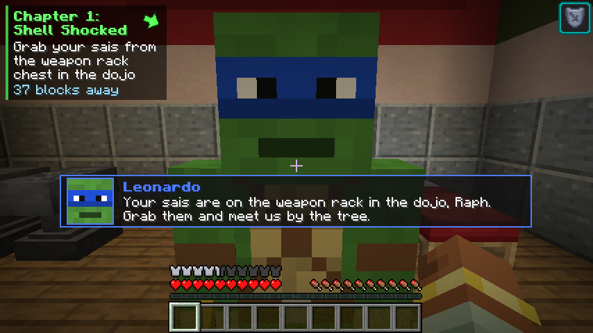
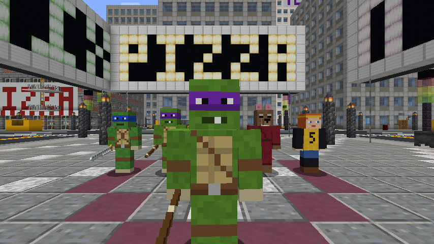
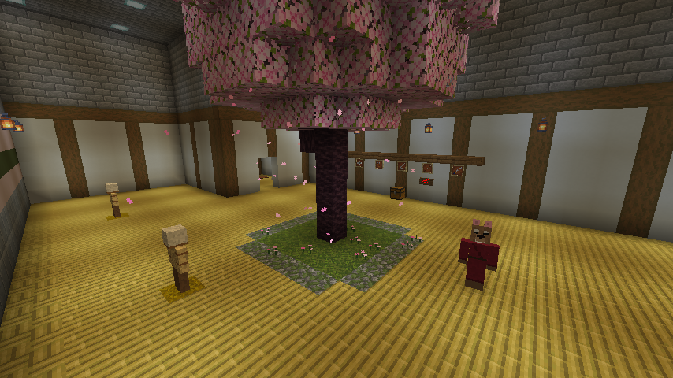
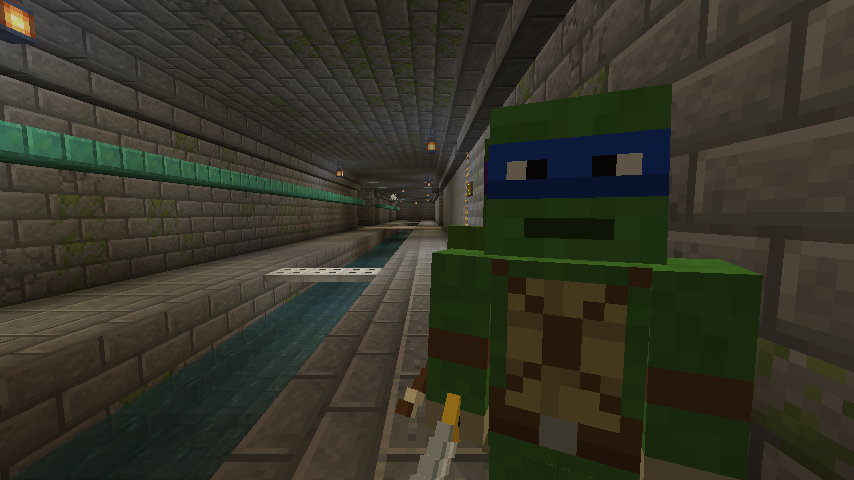
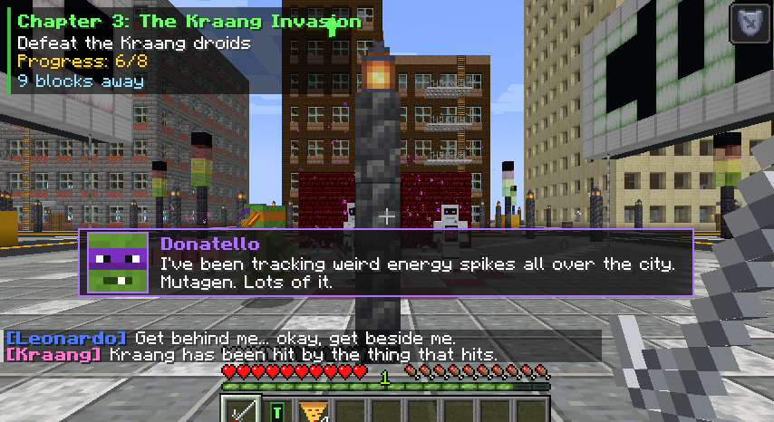
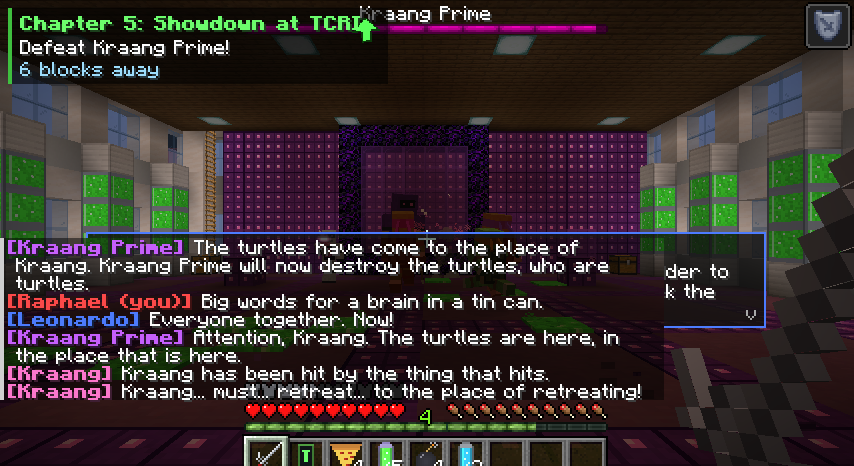
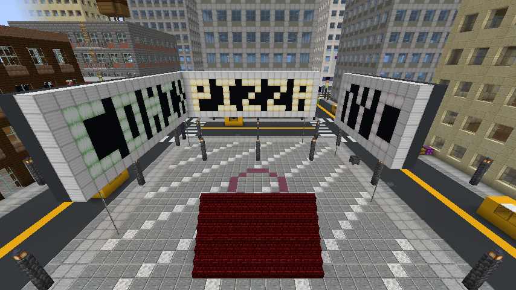
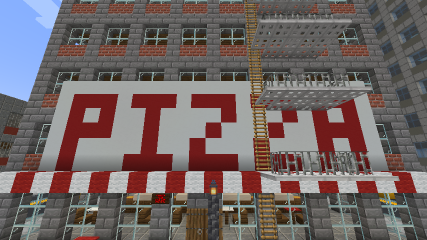
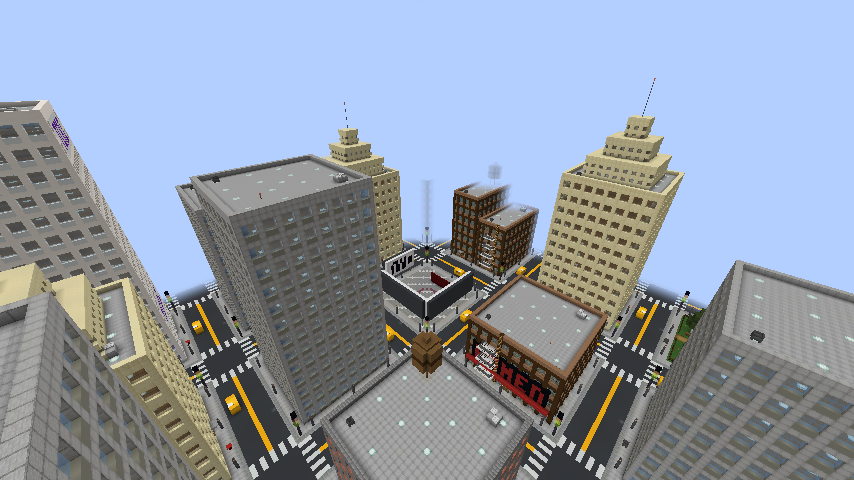
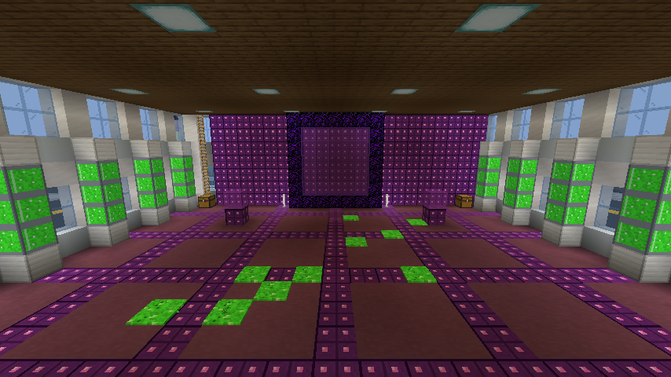

# TMNT Turtle Power: Story Mode (fan mod for Minecraft Java 1.20.1 + Forge)

**You are Raphael.** Leo, Donnie and Mikey follow you everywhere and jump on anything that tries
to hurt you. Start in the lair under New York, grab your sais, train with Master Splinter, climb up
through the sewers and a manhole, and stop the Kraang from stealing the city's mutagen.

> Unofficial fan project, made for fun. Teenage Mutant Ninja Turtles and all its characters belong to
> their owners. **Do not sell this, and don't put it behind ads or paywalls.**

| | |
|---|---|
|  |  |
|  |  |
|  |  |
|  |  |
|  |  |

(All screenshots are from the real game running this mod.)

---

## Get it running (pick ONE)

You need **Minecraft Java Edition** on a computer (Windows, Mac or Linux).
This will **not** work on Bedrock (phone, tablet, Xbox, PlayStation, Switch, Windows "Bedrock" version).

### Option A: one file, easiest (CurseForge app)
1. Install the free **CurseForge** app and open Minecraft in it.
2. Click **Create Custom Profile → Import** and choose `download/TMNT-Story-Mode-CurseForge.zip`.
3. Press **Play**. In Minecraft pick **Singleplayer → "TMNT Story Mode"**. That's it.

This one file has the mod, the world **and** tells CurseForge to install Forge for you.
(Prism Launcher and ATLauncher can import the same zip. The Modrinth App / Prism can use
`download/TMNT-Story-Mode.mrpack`.)

### Option B: by hand
1. Install **Forge 1.20.1** (47.x) from https://files.minecraftforge.net and run it once.
2. Put `download/turtlepower-1.0.0.jar` in your `.minecraft/mods` folder.
3. Unzip `download/TMNT-Story-Mode-World.zip` into your `.minecraft/saves` folder.
4. Start Minecraft with the Forge profile → Singleplayer → **TMNT Story Mode**.

### Option C: build a fresh New York any time
With the mod installed: **Singleplayer → Create New World → More → World Type: "TMNT New York
(Story Mode)"**. The mod builds the whole city, sewers and lair in a few seconds and starts the story.

In any other world you can type **`/tmnt start`** (or click the green button in chat) and the city
gets built right where you are standing (about 190 x 190 blocks, so do it somewhere empty).

---

## What's in it

**The lair** (an old subway station deep under the city): your bedroom (Spike is in his tank!),
Leo's, Donnie's and Mikey's rooms, the dojo with the big cherry tree, weapon rack and training
dummies, Master Splinter's room, the Pit with the wall of TVs, couch and Mikey's arcade, Donnie's
lab full of glowing mutagen tanks, the kitchen (pizza boxes that slowly refill), the garage with the
Shellraiser, subway stairs up to the sewer, and a secret back-door ladder into Murakami's.

**The sewers**: brick tunnels under every street with walkways, a water channel, lanterns, grates
to cross on, spilled mutagen, and **ladders up to manhole covers** you can open with your hand.

**New York City**: a 5x5 street grid with crosswalks, taxis, street lamps, traffic lights and
hydrants; brick buildings with fire escapes and water towers, brownstones, glass offices, art-deco
towers; **Antonio's Pizza** (April is inside), **Murakami's**, a **Times Square** plaza with
glowing billboards, a piece of **Central Park**, the **TCRI tower** (Kraang HQ with a portal lab),
and a harbour seawall around it all.

**Your brothers** (Leo, Donnie, Mikey):
- always stay close; if they get stuck (ladders, manholes) they ninja-vanish back to you
- attack **anything that tries to attack you**, anything that hurts you, and anything you hit
- attack Kraang and Foot ninjas on sight, never hurt you, and can't really die (they get
  "shell-shocked" and bounce back)
- talk to you, shout battle cries, and give hints if you right click them

**Items from the show**: Raph's sai, Leo's katana, Donnie's bo staff (extra reach), Mikey's
nunchucks (super fast), shuriken, ninja smoke bombs, mutagen canisters, Donnie's retro-mutagen,
the T-Phone, pepperoni pizza, Mikey's special pizza, the Kraang blaster, Raph's mask and turtle
shell (armour set bonus "Hothead": Resistance, Strength when you're low, and swimming speed),
manhole covers, mutagen tanks, mutagen ooze, Kraang tech panels and pizza boxes.

**Mutagen**: right click a mob with a canister to mutate it. Pigs become **Bebop Jr.**, cows become
**Rocksteady Jr.**, fish become **Fishface**, spiders become **Spider Bytez**, rabbits become killer
bunnies... Drink it for a 30 second Mutagen Surge. Retro-mutagen turns mutants back.

**Enemies**: Kraang droids (laser blasters, confusing Kraang-talk), the giant **Kraang Prime** boss,
Foot Clan ninjas (shuriken, leaps, smoke vanish), and mutants.

**Voice (text-to-speech)**: every line of story dialogue shows up in a dialogue box with a face
picture and is **read out loud** by your computer's voice (the same engine as Minecraft's
Narrator). Turn it on/off by **sneaking + right clicking the T-Phone**, or `/tmnt voice on|off`.

---

## The story

| Chapter | What happens |
|---|---|
| 1. Shell Shocked | Wake up in your room, grab your sais from the dojo weapon rack, knock down the training dummies, eat pizza, get the T-Phone from Donnie |
| 2. Topside | Subway stairs → sewer → **climb the ladder, open the manhole**, climb a fire escape to the rooftops, meet April at Antonio's |
| 3. The Kraang Invasion | A Kraang portal opens in Times Square: beat 8 droids, then collect 5 mutagen canisters (drops + Kraang crates) |
| 4. Mutagen Madness | Stop Spider Bytez in Central Park, bring the mutagen back so Donnie can make retro-mutagen |
| 5. Showdown at TCRI | Sneak into TCRI and defeat **Kraang Prime**, then head home for a pizza party |
| After | Free roam with random events: Kraang portals, mutagen spills, Foot Clan ambushes, pizza drops, Kraang supply crates |

The box in the top-left always says what to do next, with a green arrow and how far away it is.

## Commands

| Command | What it does |
|---|---|
| `/tmnt start` | Build New York here (or join the story) |
| `/tmnt home` | Teleport back to your room in the lair |
| `/tmnt status` | Show the current mission |
| `/tmnt turtles` | Call Leo, Donnie and Mikey to you |
| `/tmnt voice on` / `off` | Text-to-speech on or off |
| `/tmnt skip` | Finish the current step if you get stuck |
| `/tmnt chapter 1`..`6` | Jump to a chapter (6 = free roam) |
| `/tmnt event kraang_portal` | Start a city event now (`mutagen_spill`, `foot_ambush`, `pizza_drop`, `kraang_supply`) |
| `/tmnt reset` | Start the story over |

## Settings

`.minecraft/config/turtlepower-client.toml`: voice on/off, say speaker names, read idle chatter,
Raphael skin on/off, objective box on/off, copy dialogue into chat.
`turtlepower-common.toml`: random events on/off and how often, brothers' chatter, the "start story"
offer in normal worlds.

## Help, it doesn't work!

- **No voice?** Check your computer's volume and that it has a text-to-speech voice (Windows has
  them built in; on Linux install `flite`). Sneak + right click the T-Phone to toggle it.
- **"Worlds using Experimental Settings" warning** when you open the world: that's normal for worlds
  with a custom world type. Click **Proceed**.
- **Stuck in a story step?** `/tmnt skip`.
- **Lost your brothers?** Right click the T-Phone or `/tmnt turtles`.

---

## For builders (source code)

Forge 1.20.1 / Java 17. `./gradlew build` makes `build/libs/turtlepower-1.0.0.jar`.

- `tools/gen_textures.py` paints every texture (pixel art drawn with code).
- `tools/gen_assets.py` writes the models, block states, English names and the world type.
- `tools/package.py` makes the world zip and the one-file packs in `../download`.
- `./gradlew runClient -Pdevtour="World Name"` flies the camera around a built world and saves
  screenshots (used to check the builds).

Made by **Echoes in the Dark**.
